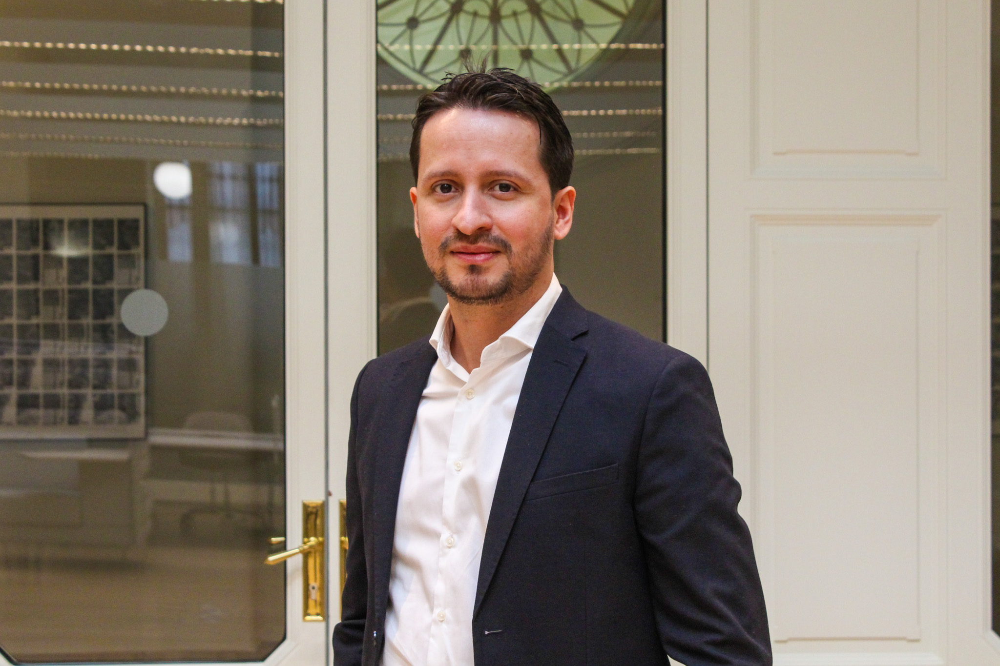

<strong>Hello, welcome to my personal website!</strong>

 I received my Ph.D in Economics from Universidad Carlos III de Madrid (2025), supervised by Prof. <a href="https://www.eco.uc3m.es/~jgonzalo/" target="_blank">Jesús Gonzalo. My research interests are centered around the intersection of <strong>time series econometrics, climate and environmental economics, development economics, and applied econometrics</strong>.

<ul><li> In September 2025, I will join the Bank of Spain as a Research Economist.</li></ul>

<ul><li> Find here my <a href="CV_AndreyRamos.pdf" target="_blank">CV</a>.</li></ul>

<ul><li>Contact: <a href="mailto:anramosr@eco.uc3m.es">anramosr@eco.uc3m.es</a> or <a href="mailto:adramosr@gmail.com">adramosr@gmail.com</a>.</li></ul>

